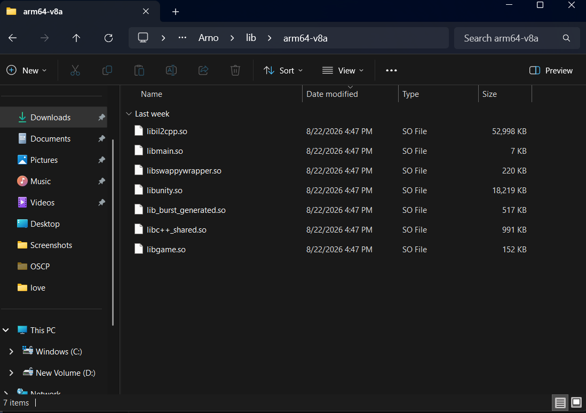
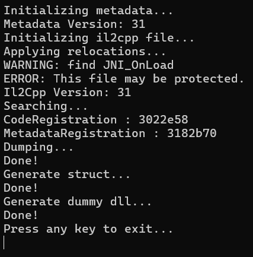
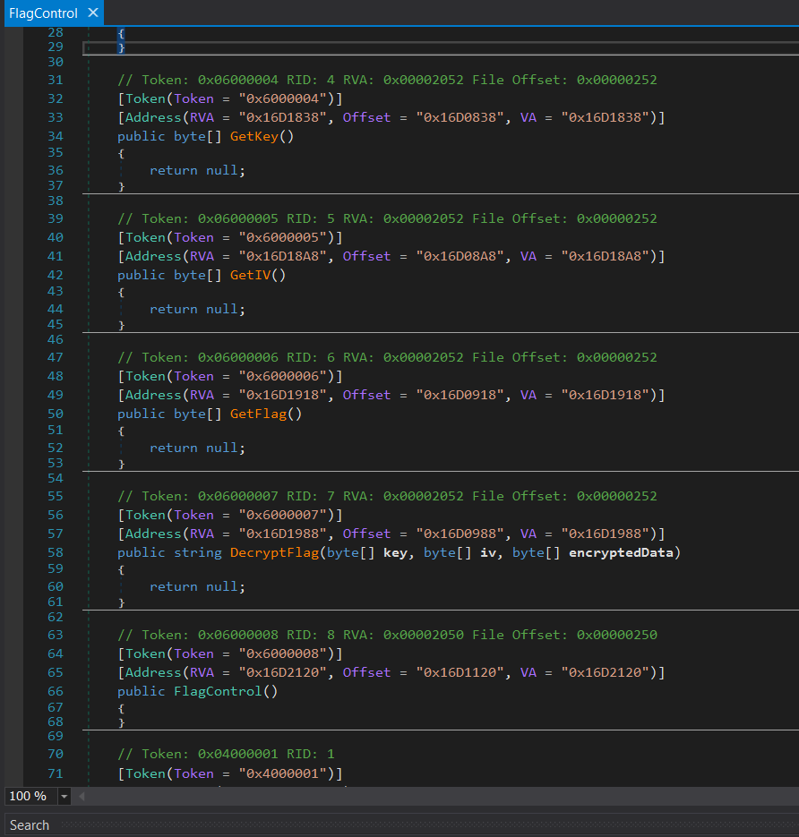
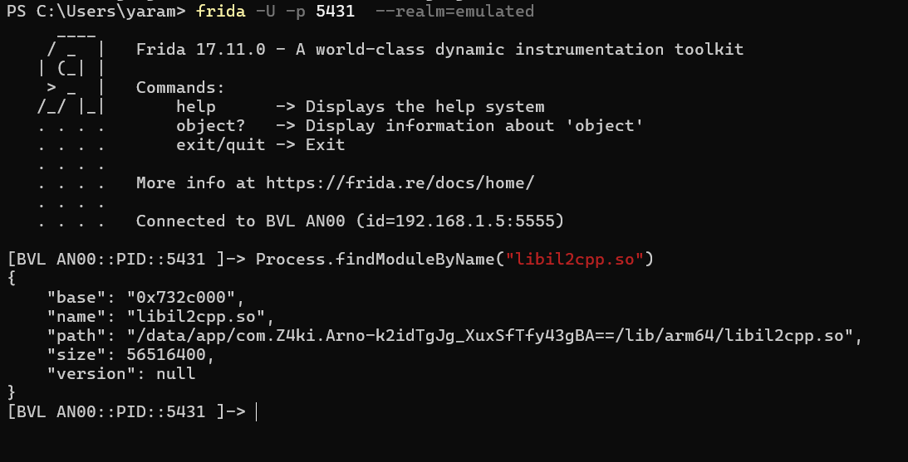
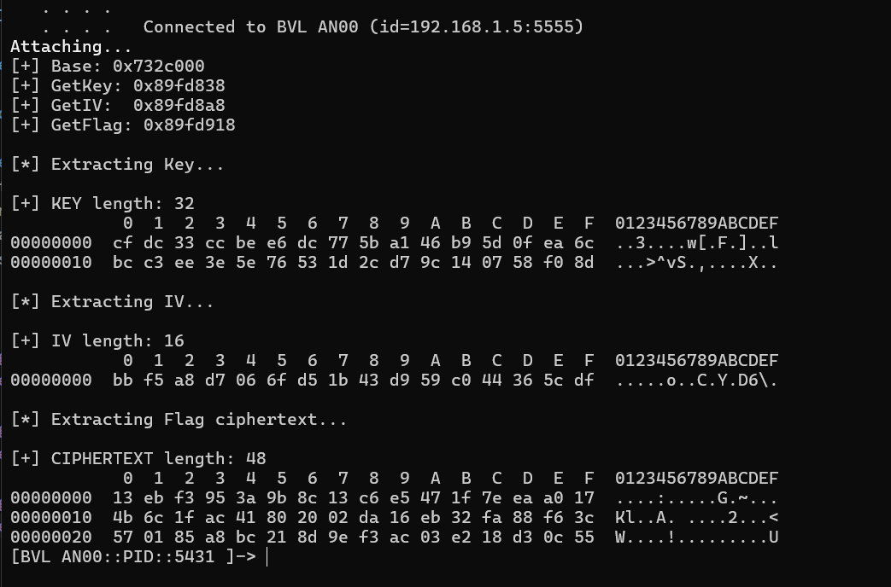
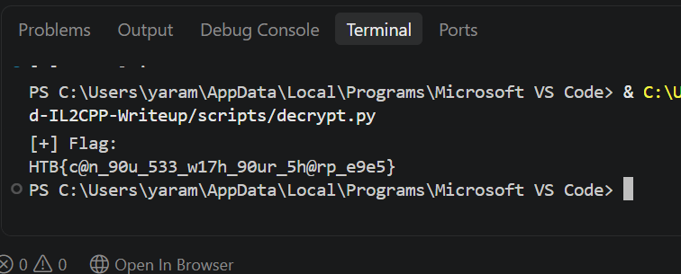

# Arno - Android IL2CPP Reverse Engineering Write-up

> Unity Android reverse engineering lab using IL2CPP, Frida and AES-CBC.

## Introduction

Arno is a Unity Android application.

The goal of this lab was to analyze the application, find how the flag was stored, extract the required data at runtime, and decrypt the flag.

## Tools

- APKTool
- Il2CppDumper
- dnSpy
- Frida
- Python
- Ghidra

---

## Methodology

The general approach was:

```text
APK
 ↓
APKTool
 ↓
libil2cpp.so + global-metadata.dat
 ↓
Il2CppDumper
 ↓
Assembly-CSharp.dll
 ↓
FlagControl
 ↓
RVA
 ↓
Frida
 ↓
libil2cpp.so base address
 ↓
Runtime addresses
 ↓
NativeFunction
 ↓
Key + IV + Ciphertext
 ↓
AES-CBC
 ↓
Flag
```

---

# 1. APK Analysis

I started by decompiling the APK using APKTool:

```bash
apktool d Arno.apk -o Arno
```

After extracting the APK, I found the main IL2CPP native library:

```text
libil2cpp.so
```

I also found the Unity IL2CPP metadata file:

```text
global-metadata.dat
```

These two files are important for analyzing a Unity IL2CPP application.

### APK Analysis



---

# 2. IL2CPP Dumping

I used Il2CppDumper with `libil2cpp.so` and `global-metadata.dat`:

```bash
dotnet Il2CppDumper.dll \
Arno/lib/arm64-v8a/libil2cpp.so \
Arno/assets/bin/Data/Managed/Metadata/global-metadata.dat
```

The tool successfully processed the files and generated the dump and dummy DLLs.

The generated files included:

```text
dump.cs
il2cpp.h
DummyDll/
```

The `DummyDll` directory contained:

```text
Assembly-CSharp.dll
```

### Il2CppDumper



---

# 3. Finding FlagControl

I opened `Assembly-CSharp.dll` using dnSpy and searched for:

```text
FlagControl
```

The class contained several interesting methods:

```text
PopulateQuotes()
ShowQuote()
GetKey()
GetIV()
GetFlag()
DecryptFlag()
```

The interesting methods also had their RVA values:

```text
GetKey      RVA = 0x16D1838
GetIV       RVA = 0x16D18A8
GetFlag     RVA = 0x16D1918
DecryptFlag RVA = 0x16D1988
```

### FlagControl Class



These methods were interesting because they provided direct access to the encryption key, IV, encrypted flag, and decryption function.

---

# 4. Getting the Runtime Base Address

The RVA is not the final runtime address.

I used Frida to find the loaded `libil2cpp.so` module:

```javascript
Process.findModuleByName("libil2cpp.so")
```

Frida returned information about the loaded module, including its base address.

For example:

```text
base: 0x71d8000
name: libil2cpp.so
```

The base address can change between application runs because of ASLR, so I used the current base address from the running process.

### Frida Base Address



---

# 5. Calculating Runtime Addresses

The runtime address can be calculated as:

```text
Runtime Address = Module Base + RVA
```

The RVAs found during static analysis were:

```text
GetKey      RVA = 0x16D1838
GetIV       RVA = 0x16D18A8
GetFlag     RVA = 0x16D1918
DecryptFlag RVA = 0x16D1988
```

I used Frida to calculate the runtime addresses:

```javascript
const lib = Process.findModuleByName("libil2cpp.so");

const getKey = lib.base.add(0x16D1838);
const getIV = lib.base.add(0x16D18A8);
const getFlag = lib.base.add(0x16D1918);
const decryptFlag = lib.base.add(0x16D1988);

console.log("[+] Base: " + lib.base);
console.log("[+] GetKey: " + getKey);
console.log("[+] GetIV: " + getIV);
console.log("[+] GetFlag: " + getFlag);
console.log("[+] DecryptFlag: " + decryptFlag);
```

For example, for `GetFlag()`:

```text
0x71d8000 + 0x16D1918 = 0x88A9918
```

So the runtime address of `GetFlag()` in this session was:

```text
0x88A9918
```

The important point is:

```text
RVA
 ↓
Static analysis

Base Address
 ↓
Running process

Base + RVA
 ↓
Runtime function address
```

---

# 6. Extracting the Key, IV and Ciphertext

After calculating the runtime addresses, I used Frida's `NativeFunction` to call the IL2CPP methods directly.

The important functions were:

```text
GetKey()
GetIV()
GetFlag()
```

The returned values were managed byte arrays.

I extracted the following data:

```text
KEY
IV
CIPHERTEXT
```

The extracted values were:

```text
KEY length        = 32 bytes
IV length         = 16 bytes
CIPHERTEXT length = 48 bytes
```

### Extracted Data



The ciphertext obtained from `GetFlag()` was:

```text
13 eb f3 95 3a 9b 8c 13
c6 e5 47 1f 7e ea a0 17
4b 6c 1f ac 41 80 20 02
da 16 eb 32 fa 88 f6 3c
57 01 85 a8 bc 21 8d 9e
f3 ac 03 e2 18 d3 0c 55
```

---

# 7. Understanding the Returned Byte Array

The IL2CPP method returned a managed `byte[]` object.

I read the array length and then read the byte data from the object.

The important part of the Frida script was:

```javascript
const length = retval.add(0x18).readU32();

const data = retval.add(0x20).readByteArray(length);
```

I then used `hexdump()` to display the bytes.

This allowed me to recover the encrypted flag data directly from the running application.

The returned object contains metadata followed by the actual byte data, which is why the script reads the length and then reads the bytes from the array data area.

---

# 8. AES-CBC Decryption

From the application logic and static analysis, I identified AES-CBC as the encryption mode.

The extracted values were:

```text
Key    = 32 bytes
IV     = 16 bytes
Data   = 48 bytes
```

A 32-byte key means AES-256.

I used Python and PyCryptodome to decrypt the ciphertext.

The important part of the Python script was:

```python
from Crypto.Cipher import AES
from Crypto.Util.Padding import unpad

cipher = AES.new(key, AES.MODE_CBC, iv)

plaintext = unpad(
    cipher.decrypt(ciphertext),
    AES.block_size
)

print(plaintext.decode())
```

### Decryption



The ciphertext was decrypted successfully and the flag was recovered.

---

# 9. Lessons Learned

This lab helped me understand the basic workflow for reverse engineering Unity IL2CPP Android applications.

The main things I learned were:

- How Unity IL2CPP applications store native code.
- How `global-metadata.dat` can be used with `libil2cpp.so`.
- How to use Il2CppDumper to recover useful class and method information.
- How to identify interesting classes and functions using dnSpy.
- What an RVA is.
- How to get the runtime base address using Frida.
- How to calculate a runtime address using `Base Address + RVA`.
- How to use Frida `NativeFunction` to call native IL2CPP functions.
- How to read returned byte arrays from memory.
- How to extract encryption material from an application at runtime.
- How to identify AES-CBC encryption.
- How to decrypt AES-CBC encrypted data using Python.

---

# 10. Final Workflow

The complete workflow was:

```text
Decompile APK
      ↓
Find libil2cpp.so
      ↓
Find global-metadata.dat
      ↓
Run Il2CppDumper
      ↓
Open Assembly-CSharp.dll
      ↓
Find FlagControl
      ↓
Find GetKey / GetIV / GetFlag
      ↓
Get their RVAs
      ↓
Attach Frida
      ↓
Find libil2cpp.so base
      ↓
Base + RVA
      ↓
Get runtime addresses
      ↓
Call functions with NativeFunction
      ↓
Extract Key + IV + Ciphertext
      ↓
Identify AES-CBC
      ↓
Decrypt with Python
      ↓
Recover the flag
```

---

# Conclusion

This lab showed how static and dynamic analysis can be combined when analyzing a Unity IL2CPP Android application.

Static analysis helped identify the `FlagControl` class and the RVAs of its methods.

Frida was then used to find the runtime base address of `libil2cpp.so` and calculate the runtime addresses of the target functions.

Finally, I called the functions at runtime to extract the key, IV and ciphertext, and used Python to decrypt the ciphertext with AES-CBC.

```text
Static Analysis
      +
Dynamic Analysis
      +
Cryptographic Analysis
      =
Flag Recovery
```

---

## Repository Structure

```text
Arno-IL2CPP-Reverse-Engineering/
│
├── README.md
│
├── scripts/
│   ├── addresses.js
│   ├── extract.js
│   └── decrypt.py
│
└── screenshots/
    ├── apk-analysis.png
    ├── il2cpp-dumper.png
    ├── flagcontrol.png
    ├── frida-base.png
    ├── extracted-data.png
    └── decryption.png
```
